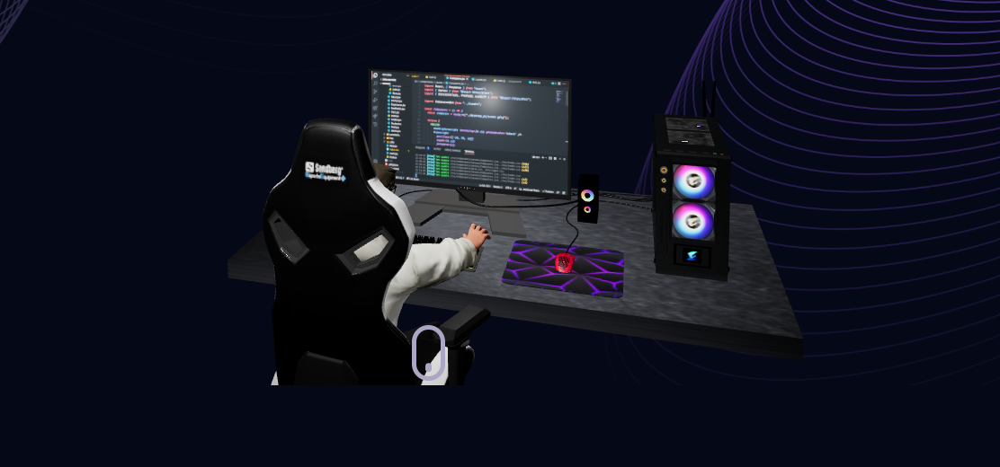

<h1 align="center">Code. Debug. Deploy. Repeat. 🔄</h1>
<h3 align="center">Welcome to my dev world! 👨‍💻</h3>

  <b>Myself Tanmay Sontakke.</b>

---

  
  

---

### 🚀 About Me
🔹 Full-Stack Developer | MERN | AI Enthusiast  
🔹 Passionate about building scalable and efficient applications  
🔹 Exploring AI, Web Development, and Game Development  

### 🛠 Tech Stack
🔹 **Frontend:** HTML, CSS, JavaScript, ReactJS  
🔹 **Backend:** Node.js, Express.js, MongoDB  
🔹 **Tools:** Git, GitHub, VS Code, Postman  

### 📊 GitHub Stats

  
  

### 📫 Connect with Me  
  

---

⭐ **Feel free to explore my repositories and collaborate!** 🚀
